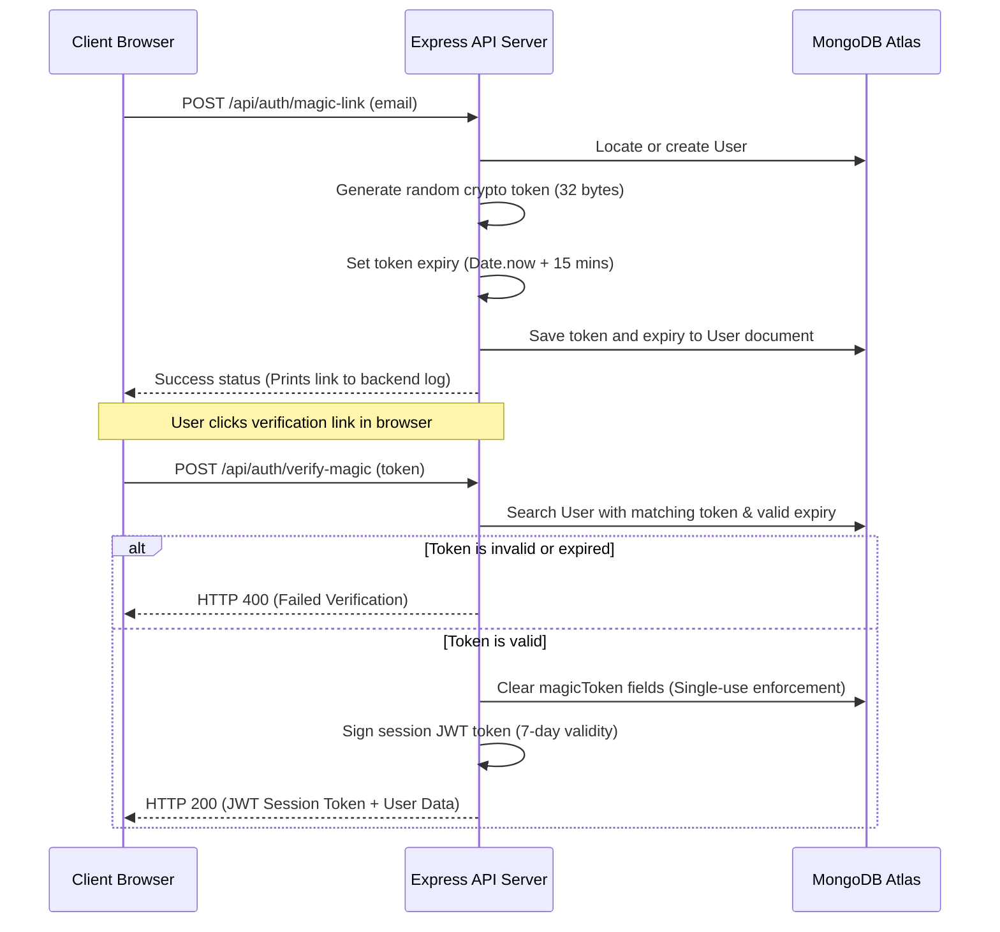

# AI Career Sync Backend: API Architecture & Implementation Guide

This is the backend API service for **AI Career Sync**. It is built on the **Node.js** runtime using the **Express** framework and connects to a **MongoDB** database cluster. It acts as the gateway for user authentication, file ingestion, and orchestrating Large Language Model prompts.

---

## 🛠️ System Overview & Responsibilities

The backend server is responsible for several critical business processes:

1. **Secure Session Authentication:** Implements password-less *Magic Link* authentication and standard login/registration flows.
2. **File Processing & Extraction:** Handles resume uploads in PDF, Word (`.docx`), and text formats. Ingests file buffers using `multer` and extracts raw strings using `pdf-parse`.
3. **Prompt Engineering & Structured Outputs:** Constructs system prompts for career matching, queries the OpenRouter load balancer, and parses unstructured LLM responses into strict JSON objects matching the application's dashboard schemas.
4. **API Security Controls:** Defends endpoints from denial-of-service attempts using rate limiters and secures request routing with JWT verification.

---

## 🏗️ Architecture Design & Separation of Concerns

The service uses a modular structure to separate concerns and support scaling:

* **Entry Point (`server.js`):** Initializes the Express application, configures global CORS options, loads environment variables, registers loggers (`morgan`), sets up static upload folders, connects to MongoDB, and registers top-level API routers.
* **Routes (`src/routes/`):** Listens to incoming HTTP endpoints and mounts path routes. Routes focus strictly on mapping URLs and forwarding validation parameters:
  * `auth.js`: Registration, login, magic link generation, and magic token validation.
  * `analyze.js`: Ingests resume uploads, parses documents, and triggers the AI analysis engine.
  * `user.js`: Fetches logged-in profiles and manages scan histories.
* **Services (`src/services/`):** Contains business logic classes and third-party integrations:
  * `aiService.js`: Formulates prompts and communicates with the OpenRouter REST interface.
* **Models (`src/models/`):** Defines schema structures and index keys for MongoDB database collections via Mongoose.
* **Middleware (`src/middleware/`):** Houses request guards:
  * `authMiddleware.js`: Inspects `Authorization` Bearer headers and verifies JWT payloads.
  * `rateLimiter.js`: Limits request frequency by IP address.

---

## 💾 Database Schema: `User` Model

The database stores user profiles and tracking variables. 

```javascript
const userSchema = new mongoose.Schema({
  name: { type: String, required: true },
  email: { type: String, required: true, unique: true },
  password: { type: String, required: false },
  scans: { type: Array, default: [] },
  magicToken: { type: String, required: false },
  magicTokenExpires: { type: Date, required: false }
});
```

* **`scans`:** Stored as an array of JSON objects representing previous resume assessment indexes.
* **`magicToken` / `magicTokenExpires`:** Short-lived security strings used to authenticate passwordless registration links.

---

## 🔐 The Secure Magic Link Protocol

To prevent authentication bypass attacks, the login process operates under a verified redirect pattern:



---

## 🧠 AI Prompt Construction & Processing

When a student submits their resume at `/api/analyze`, the API extracts the raw text from the file and combines it with parameters like **Target Industry** and **Graduation Year** to populate a detailed prompt template:

```
You are the "Student Career Advisor & Resume Scanner AI".
Your directive is to analyze the student's resume and synthesize their alignment with modern, real-world career paths in the industry of "{industry}" for their target graduation year of "{gradYear}".
...
JSON FORMAT:
{
  "score": number (0-100),
  "recommended_pathway": "string",
  "alternative_pathways": ["string"],
  "skills": ["string"],
  "keywords": ["string"],
  "feedback": "string",
  "missing_skills": [{ "name": "string", "path": ["string"] }],
  "certifications": [{ "name": "string", "course": "string" }],
  "technical_alignment": number,
  "soft_skills": number,
  "career_timeline": [{ "year": "string", "role": "string", "location": "string" }],
  "experience_level": "string"
}
```

### Key Logic:
1. **Load Balancer Routing:** Sends request to `openrouter/free`, which queries active free models (like Google Gemma or Cohere Command) to avoid service interruptions.
2. **Robust JSON Pruning:** Cleans responses to handle cases where the LLM wraps code block elements (e.g. ```json ... ```) or returns markdown text outside the JSON boundaries.
3. **Parse Fallbacks:** In case of API failure or JSON parsing errors, it falls back to a standardized placeholder structure to prevent application crashes.

---

## 💻 Setup & Environment Configurations

### 1. Variables Definition (`.env` Parameters)
Create a `.env` file in the root of the `backend/` directory:

* `PORT`: Server port (defaults to 5000).
* `MONGO_URI`: The MongoDB Atlas connection string.
* `JWT_SECRET`: A secure key used for signing session JWT tokens.
* `OPENROUTER_API_KEY`: API authorization token from OpenRouter dashboard.
* `OPENROUTER_MODEL`: Model name target (defaults to `openrouter/free`).

### 2. Available Run Commands
* **Start Server:** `npm start` (Runs standard node runtime).
* **Developer Hot-Reload:** `npm run dev` (Starts Nodemon to auto-restart the server on file changes).
